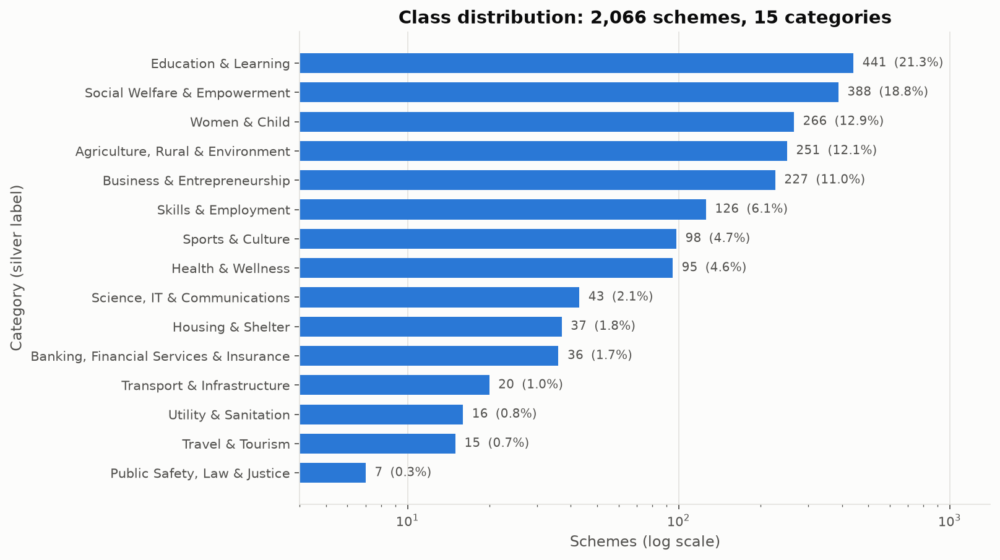
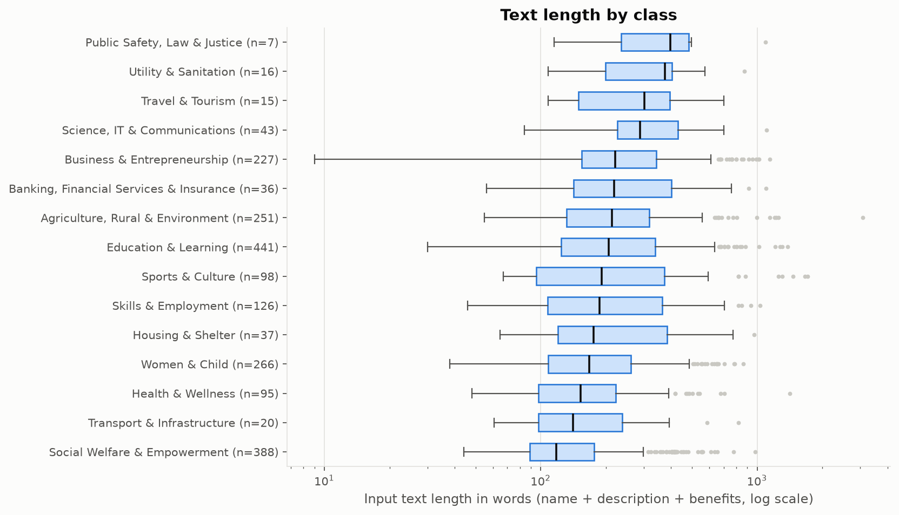
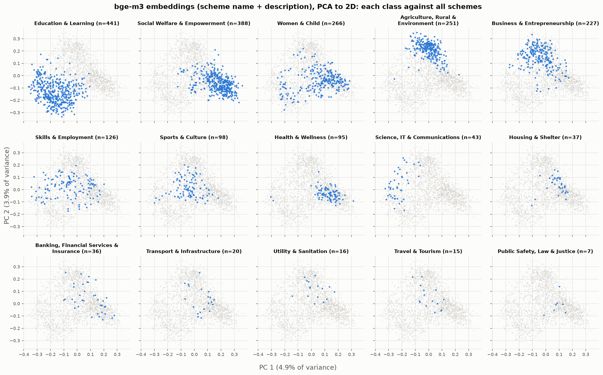
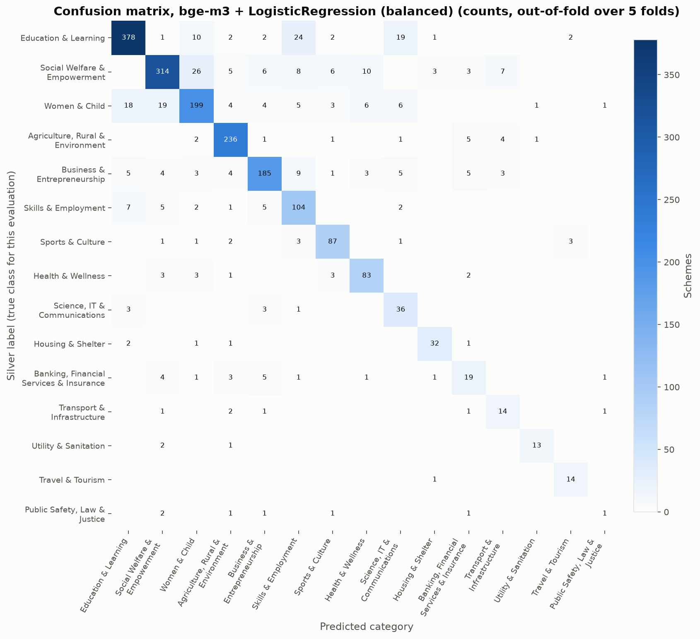
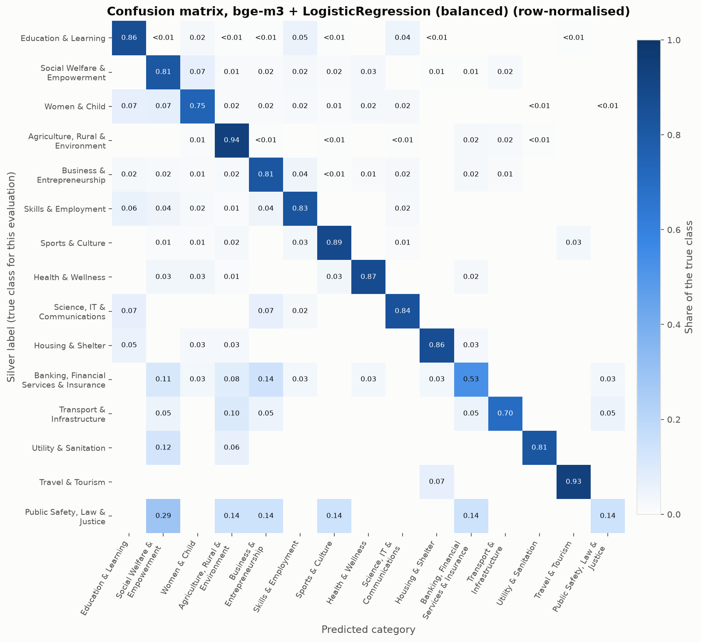

# Scheme category classifier

A supervised text classifier that predicts a welfare scheme's myScheme
category (15 classes) from its text. It is a standalone component: it reads the
project's data and writes its own outputs, and nothing in the matching
pipeline uses it.

- **Code:** `scripts/classifier/` (`common.py`, `eda.py`, `plots.py`,
  `train_eval.py`, `label_ceiling.py`, `group_cv.py`, `c_grid.py`,
  `run_all.py`)
- **Outputs:** `data/eval/classifier/` (metrics as JSON and CSV, out-of-fold
  predictions, figures, the saved final model)
- **Run end to end:** `python scripts/classifier/run_all.py` takes about 5
  minutes on an 8-core laptop.
- **Seed:** 42, used for every fold split, the inner CV, the random forest,
  the PCA and the error sample. Python's and NumPy's global seeds are also set.

## Dataset

| Source | File | Rows |
|---|---|---:|
| Scheme records | `data/interim/schemes/<slug>.json` | 2,066 |
| Silver category labels | `data/interim/labels/predictions.json` | 2,066 |
| Joined on slug | | **2,066** |

The labels are **silver labels**: an LLM assigned them, given each scheme's
name, description and benefits text (`scripts/label_categories.py`). The
labelling model is recorded per scheme:

| Labelling model | Schemes |
|---|---:|
| gemini-3.1-flash-lite (brief mode, batches of 10) | 1,662 |
| openai/gpt-oss-120b via Groq | 327 |
| gemini-3.6-flash | 77 |

**Corrections to the handoff figures.** Two figures given in the project
handoff are stale; this report uses the counts in the data:
- **Classes with fewer than 25 schemes: four, not five.** They are Transport
  (20), Utility (16), Travel (15) and Public Safety (7). The next smallest,
  Banking, has 36.
- **Groq-labelled schemes: 327, not 462.** 327 is the count in the current
  `predictions.json`. It was 375 before the relabelling pass over Social
  Welfare schemes (`predictions.json.bak-pre-swe-merge-2026-09-21`). Neither
  file has 462.

### Class distribution

| Category | Schemes | % |
|---|---:|---:|
| Education & Learning | 441 | 21.3 |
| Social Welfare & Empowerment | 388 | 18.8 |
| Women & Child | 266 | 12.9 |
| Agriculture, Rural & Environment | 251 | 12.1 |
| Business & Entrepreneurship | 227 | 11.0 |
| Skills & Employment | 126 | 6.1 |
| Sports & Culture | 98 | 4.7 |
| Health & Wellness | 95 | 4.6 |
| Science, IT & Communications | 43 | 2.1 |
| Housing & Shelter | 37 | 1.8 |
| Banking, Financial Services & Insurance | 36 | 1.7 |
| Transport & Infrastructure | 20 | 1.0 |
| Utility & Sanitation | 16 | 0.8 |
| Travel & Tourism | 15 | 0.7 |
| Public Safety, Law & Justice | 7 | 0.3 |

Four classes have fewer than 25 schemes. The smallest, Public Safety, Law &
Justice, has 7, so each test fold holds one or two of them.

## Input text

Length of each candidate field, in words (non-empty records only):

| Field | Empty | Median | Q1 | Q3 | Max |
|---|---:|---:|---:|---:|---:|
| scheme_name | 0 | 6 | 4 | 9 | 33 |
| description | 0 | 100 | 67 | 165 | 1,320 |
| benefits_text | 20 | 54 | 26 | 116 | 2,570 |
| eligibility_text | 4 | 82 | 46 | 156 | 1,408 |
| tags | 33 | 6 | 5 | 7 | 33 |

**Choice: `scheme_name + description + benefits_text`, untruncated**, joined
with full stops. The labels are a function of exactly these three fields: the
labeller's prompt contains the scheme name, description and benefits and
nothing else. So they are the text that can explain the labels, and none is
ever empty for the name or description. They are used untruncated, although
most labels were produced from the first 400 characters of the description and
200 of the benefits (the labeller's brief mode). The full text is closer to
what a scheme is actually about, and the truncation was a cost-saving choice,
not part of the taxonomy.

`eligibility_text` is **not** used. It is what the constraint extractor reads,
but it describes *who* qualifies (age, income, residence) rather than *what
the scheme is for*, and the labeller never saw it. Adding it would feed the
model information the labels do not depend on.

`tags` are **not** used either; see the confound check below. The median input
is 180 words (Q1 112, Q3 306, range 9–3,084).

## Exploratory findings

**Most distinctive terms per class.** Weighted log-odds with an informative
Dirichlet prior, each class against the rest, unigrams:

| Category | Top terms |
|---|---|
| Education & Learning | students, scholarship, education, courses, student, class |
| Social Welfare & Empowerment | pension, citizens, persons, death, senior, welfare |
| Women & Child | women, child, girl, girls, children, marriage |
| Agriculture, Rural & Environment | farmers, agriculture, farm, seed, farmer, subsidy |
| Business & Entrepreneurship | industries, units, enterprises, capital, startups, entrepreneurs |
| Skills & Employment | training, skill, skills, trainee, trainees, stipend |
| Sports & Culture | sports, culture, artists, art, award, cultural |
| Health & Wellness | treatment, health, medical, hospitals, surgery, diseases |
| Science, IT & Communications | research, scientist, technology, serb, scientists, fellowship |
| Housing & Shelter | housing, house, houses, pucca, ghar, mig |
| Banking, Financial Services & Insurance | insurance, premium, insured, coconut, palm, bima |
| Transport & Infrastructure | bus, border, pass, road, buses, concession |
| Utility & Sanitation | lpg, sanitation, waste, swachh, odf, defecation |
| Travel & Tourism | tourism, tea, homestay, tourists, breakfast, pilgrims |
| Public Safety, Law & Justice | injury, compensation, loss, victim, particular, resulting |

**Duplicates.**

- No two schemes have the same input text.
- Three groups of sub-schemes (7 records, all `naospasa-*`) share their
  description and benefits and differ only in name; each group has one label.
- The stored bge-m3 vectors find **76 near-duplicate pairs** (cosine ≥ 0.95)
  involving 85 schemes, mostly the same scheme offered in several states or
  under several sub-names; 72 of the 76 pairs have the same label. Joined
  transitively (connected components), the pairs form **34 groups**: 27 pairs,
  4 of three schemes, 1 of five and 2 of seven. Three groups mix labels. Their
  effect on the score is measured under [Near-duplicates](#near-duplicates-group-aware-cv).

**2D projection.** The first two principal components explain only 8.8% of
the variance. Education, Agriculture and Business still occupy distinct
regions, while Social Welfare, Women & Child and Health overlap.

### Confound check

Could a trivial artefact predict the class? Each input below was tested alone,
under the same stratified 5-fold CV and pipeline rules, with
LogisticRegression at C=1:

| Input alone | Macro-F1 | Accuracy |
|---|---|---|
| Majority class | 0.024 | 0.213 |
| tags (myScheme's own tags) | 0.418 ± 0.012 | 0.722 ± 0.011 |
| scheme_name | 0.317 ± 0.019 | 0.608 ± 0.012 |
| state + level | 0.094 ± 0.005 | 0.303 ± 0.018 |

- **Tags are informative but not near-perfect.** 42.9% of schemes have a tag
  containing a word of their own category's name, 76.6% one containing a word
  of *some* category, and only 7 have a tag equal to the category name. Tags
  are left out anyway, because the labeller never saw them; using them would
  measure agreement with myScheme's tagging rather than with the text.
- **State and level barely beat the majority class.** Where a scheme runs says
  little about its category.
- **The scheme name alone is a real but partial signal.** For example,
  "Scholarship" points to Education. That is content, not an artefact; the
  full text adds 0.43 macro-F1 over the name alone.

## Cleaning

| Step | Effect |
|---|---|
| Mojibake repair (ftfy) | 1 field changed |
| Section heading glued to the text removed ("BenefitsProvides…" → "Provides…") | 97 fields |
| Run-on words split ("Aadhaar CardLandholding", "shops.Provides" → separate words) | 2,193 fields; a sample of the splits was checked by hand and all were genuine run-ons from the scrape |
| Whitespace collapsed | 5 fields |
| Empty text | Nothing dropped: no record lacks a name or description; the 20 with no benefits text use name + description |
| Deduplication | Nothing dropped (see Duplicates). The near-duplicates are distinct schemes, so they are kept. Group-aware CV shows they do not inflate the headline score (see [Near-duplicates](#near-duplicates-group-aware-cv)) |
| Lowercasing | Done by the TF-IDF vectorizer inside each pipeline. The stored text keeps case, as the embeddings were computed on cased text |

**Rows before cleaning: 2,066. Rows after: 2,066.** No class lost any rows.

## Evaluation design

**Stratified 5-fold cross-validation** (`StratifiedKFold(n_splits=5,
shuffle=True, random_state=42)`), not a single train/test split. Four classes
have fewer than 25 schemes, and Public Safety has 7. A single 80/20 split
would test those classes on one to four schemes, so their F1 would rest on a
coin flip. With 5 folds every scheme is tested exactly once, and the fold
spread shows how stable each score is. Every model uses the same five folds.

**Metrics:**
- **Headline:** macro-F1, which weights each of the 15 classes equally, so the
  small classes count.
- **Also reported:** weighted-F1 and accuracy, each as mean ± standard
  deviation over the five folds.
- **Per-class tables** pool the out-of-fold predictions, and show support next
  to each class.

**Leakage:**
- **Transforms per fold.** Every vectorizer is inside a scikit-learn
  `Pipeline` fitted on the training part of each fold only.
- **Stored embeddings.** The bge-m3 vectors come from the retrieval index,
  computed before any split. That is not leakage: the encoder is pretrained and
  frozen, each vector depends only on its own scheme's text, and no statistic
  is fitted across schemes. The classifier on top is fitted per fold. One
  caveat that is not fold leakage: bge-m3's pretraining data may have included
  myScheme pages.
- **EDA-only statistics.** The PCA, the term statistics and the near-duplicate
  search were computed on all data, for description only. No evaluated model
  uses them. The near-duplicate groups also define the folds of the
  group-aware check; they use no labels and never enter a model.

**Tuning, the only tuning done:**
- **What:** C ∈ {0.1, 1, 10} for the LogisticRegression and LinearSVC models.
- **How:** an inner stratified 3-fold CV on the training part of each outer
  fold, scored by macro-F1 (nested CV). The outer test fold never influences it.
- **Fixed in advance, not tuned:** the TF-IDF settings (word 1–2-grams,
  `sublinear_tf`, `min_df=2`, `max_df=0.95`, accents stripped) and the random
  forest (500 trees, default settings).
- **Grid edge:** four of the six tuned models chose C=10, the top of the grid,
  in all five folds: TF-IDF + LogisticRegression, TF-IDF + LinearSVC, and
  bge-m3 + LogisticRegression with and without balancing. For the best model
  the grid was widened afterwards (see [C grid](#c-grid-for-the-best-model)).
  The other three were not re-tuned, so they may be slightly under their best.

## Results

| Model | Macro-F1 | Weighted-F1 | Accuracy |
|---|---|---|---|
| Majority class | 0.024 ± 0.000 | 0.075 ± 0.001 | 0.213 ± 0.001 |
| TF-IDF + LogisticRegression | 0.577 ± 0.029 | 0.776 ± 0.009 | 0.793 ± 0.007 |
| TF-IDF + LogisticRegression (balanced) | 0.658 ± 0.037 | 0.781 ± 0.024 | 0.781 ± 0.034 |
| TF-IDF + LinearSVC | 0.663 ± 0.023 | 0.804 ± 0.010 | 0.812 ± 0.007 |
| TF-IDF + LinearSVC (balanced) | 0.688 ± 0.021 | 0.813 ± 0.014 | 0.817 ± 0.013 |
| TF-IDF + RandomForest | 0.454 ± 0.035 | 0.704 ± 0.013 | 0.741 ± 0.008 |
| TF-IDF + RandomForest (balanced) | 0.651 ± 0.030 | 0.772 ± 0.010 | 0.777 ± 0.010 |
| bge-m3 + LogisticRegression | 0.705 ± 0.022 | 0.831 ± 0.015 | 0.838 ± 0.013 |
| **bge-m3 + LogisticRegression (balanced)** | **0.742 ± 0.026** | **0.831 ± 0.014** | **0.830 ± 0.012** |

Full per-fold numbers and the C chosen per fold are in
`data/eval/classifier/cv_results.json`.

**Balanced class weights raise macro-F1 in every model family.** The gains are
+0.081 (TF-IDF + LogisticRegression), +0.025 (LinearSVC), +0.197
(RandomForest) and +0.037 (bge-m3 + LogisticRegression). Accuracy changes by
−0.012 to +0.036: balancing trades a little accuracy on the large classes for
recall on the small ones.

**The best model** is bge-m3 + LogisticRegression (balanced). It was chosen by
mean macro-F1 on the same folds reported here, among eight candidates. Its
lead over the unbalanced bge-m3 model (0.037) is about 1.4 fold standard
deviations; its lead over the best TF-IDF model (0.054) is larger than the
fold spread.

### Near-duplicates: group-aware CV

Under plain stratified CV, a scheme can be tested while its near-twin (one of
the 34 near-duplicate groups, 85 schemes) sits in the training folds. The best
model was re-scored three ways, all with C=10, the value its nested CV chose
in every original fold. With C fixed at 10 the original folds reproduce the
reported numbers exactly (`scripts/classifier/group_cv.py`,
`near_duplicate_cv.json`).

| Treatment | Schemes | Macro-F1 | Weighted-F1 | Accuracy |
|---|---:|---|---|---|
| Original stratified CV (as reported) | 2,066 | 0.742 ± 0.026 | 0.831 ± 0.014 | 0.830 ± 0.012 |
| Group-aware CV: near-duplicates never split across folds | 2,066 | 0.742 ± 0.023 | 0.831 ± 0.014 | 0.830 ± 0.013 |
| Near-duplicates dropped, one per group kept | 2,015 | 0.748 ± 0.033 | 0.833 ± 0.017 | 0.831 ± 0.018 |

- **Design.** The group-aware run uses `StratifiedGroupKFold(n_splits=5,
  shuffle=True, random_state=42)`. Each near-duplicate group has one group id,
  and each other scheme has its own.
- **Stratification held, so no fallback was needed.** Every class is in every
  test fold, and every class is within one scheme of an exact fifth of its size
  per fold. That is the same balance as the original split; Public Safety, for
  example, is split 1/2/1/2/1. `GroupKFold` was therefore not needed. Both
  designs' per-fold class support is in `near_duplicate_cv.json`.
- **The leak is real but too small to move the headline.** On the 85 grouped
  schemes, accuracy falls from 0.882 to 0.753 once near-twins share a fold.
  That is about 11 schemes that were right only because a twin was in
  training. It is 0.5% of the corpus, and reassigning folds moves the other
  1,981 schemes by as much the other way (0.828 → 0.833). Macro-F1 goes from
  0.7419 to 0.7421.
- **Dropping the duplicates** removes 51 schemes: Social Welfare 18, Women &
  Child 8, Education 8, Sports 7, Agriculture 5, others 5. This changes the
  dataset, not only the split, so that row is not strictly comparable. It
  falls within the fold spread of the other two.

### C grid for the best model

The original grid {0.1, 1, 10} was cut off: bge-m3 + LogisticRegression
(balanced) chose C=10 in every fold. The same nested CV was re-run for that
model alone, with the same outer and inner folds and macro-F1 scoring, over
C ∈ {0.1, 1, 10, 30, 100, 300, 1000} (`scripts/classifier/c_grid.py`,
`c_grid_best_model.json`).

| Outer fold | 0 | 1 | 2 | 3 | 4 |
|---|---:|---:|---:|---:|---:|
| C chosen, original grid | 10 | 10 | 10 | 10 | 10 |
| C chosen, wider grid | 30 | 10 | 100 | 10 | 30 |
| Macro-F1, original grid | 0.710 | 0.788 | 0.735 | 0.747 | 0.729 |
| Macro-F1, wider grid | 0.719 | 0.788 | 0.738 | 0.747 | 0.748 |

- **C settles inside the grid.** No fold picks 1,000, so the grid did not need
  a second extension. Mean inner-CV macro-F1 by C:

  | C | 0.1 | 1 | 10 | 30 | 100 | 300 | 1,000 |
  |---|---|---|---|---|---|---|---|
  | Inner-CV macro-F1 | 0.589 | 0.680 | 0.715 | 0.716 | 0.709 | 0.702 | 0.691 |

  The curve is flat between 10 and 30, so C=10 was already close to the best
  value.
- **New score:** macro-F1 **0.748 ± 0.022**, weighted-F1 0.835 ± 0.010,
  accuracy 0.835 ± 0.008. That is +0.006 macro-F1, about a quarter of the fold
  spread. No fit raised a convergence warning.
- **No other model was re-tuned.** Three other rows also chose the top C in
  every fold (see Evaluation design) and keep the original grid.

### Headline number

**The headline is macro-F1 0.742 ± 0.026.** It comes from bge-m3 +
LogisticRegression (balanced), under stratified 5-fold CV with the original C
grid. Why this number:
- **Group-aware CV gives the same value** (0.7421 vs 0.7419), so
  near-duplicates do not inflate it.
- **The wider C grid adds only 0.006,** within the fold spread. The original
  grid also keeps the best model on the same terms as the other rows of the
  comparison table, which were not re-tuned.
- **It matches the analysis below.** The per-class table, confusion matrices,
  error sample and label-ceiling comparison all come from this run's
  out-of-fold predictions.

Read it as slightly conservative: the best-tuned figure is 0.748 ± 0.022.

### Per-class results for the best model

Out-of-fold predictions pooled over the five folds:

| Category | Precision | Recall | F1 | Support |
|---|---:|---:|---:|---:|
| Education & Learning | 0.915 | 0.857 | 0.885 | 441 |
| Social Welfare & Empowerment | 0.882 | 0.809 | 0.844 | 388 |
| Women & Child | 0.802 | 0.748 | 0.774 | 266 |
| Agriculture, Rural & Environment | 0.897 | 0.940 | 0.918 | 251 |
| Business & Entrepreneurship | 0.869 | 0.815 | 0.841 | 227 |
| Skills & Employment | 0.671 | 0.825 | 0.740 | 126 |
| Sports & Culture | 0.837 | 0.888 | 0.861 | 98 |
| Health & Wellness | 0.806 | 0.874 | 0.838 | 95 |
| Science, IT & Communications | 0.514 | 0.837 | 0.637 | 43 |
| Housing & Shelter | 0.842 | 0.865 | 0.853 | 37 |
| Banking, Financial Services & Insurance | 0.513 | 0.528 | 0.520 | 36 |
| Transport & Infrastructure | 0.500 | 0.700 | 0.583 | 20 |
| Utility & Sanitation | 0.867 | 0.812 | 0.839 | 16 |
| Travel & Tourism | 0.737 | 0.933 | 0.824 | 15 |
| Public Safety, Law & Justice | 0.250 | 0.143 | 0.182 | 7 |

- **Banking & Insurance** lands at 0.53 recall, its schemes being split among
  Business, Social Welfare and Agriculture.
- **Balanced weights over-predict some small classes.** Science, IT and
  Transport have precision well under recall.

**Public Safety, Law & Justice (n = 7, F1 0.18) is a finding about the
corpus, not a model defect to fix.** Only 7 of 2,066 schemes carry the label,
so each training fold holds five or six and each test fold one or two. Its
schemes are accident and victim compensation, worded much like Social Welfare,
which has 388. One more correct prediction would double its recall. No
classifier learns a category from five examples that read like a class fifty
times larger. The score measures how thinly the scraped corpus covers the
category. Macro-F1 was chosen so that such a class counts: this one costs
about 0.04 macro-F1 compared with a class at the others' median F1 (0.84).
Oversampling would hide the gap, and merging would change the 15-class
taxonomy. Only more Public Safety schemes would close it.

### Confusions

The largest confusions (true → predicted, count, share of the true class):

| True class | Predicted | Schemes | Share |
|---|---|---:|---:|
| Social Welfare & Empowerment | Women & Child | 26 | 6.7% |
| Education & Learning | Skills & Employment | 24 | 5.4% |
| Education & Learning | Science, IT & Communications | 19 | 4.3% |
| Women & Child | Social Welfare & Empowerment | 19 | 7.1% |
| Women & Child | Education & Learning | 18 | 6.8% |
| Education & Learning | Women & Child | 10 | 2.3% |
| Social Welfare & Empowerment | Health & Wellness | 10 | 2.6% |

**Two boundaries cause most of the errors.**
- **Beneficiary vs purpose.** "Women & Child" is defined by *who* a scheme
  serves, while Education, Social Welfare and Business are defined by what it
  is for. A scholarship for girls or a pension for widows fits both, and the
  model and labels settle such cases differently. This accounts for the
  Social Welfare ↔ Women & Child and Women & Child → Education confusions.
- **Neighbouring purposes.** Education overlaps Skills (vocational training,
  apprenticeships) and Science (research fellowships).

**Education vs Social Welfare, the known labelling ambiguity, has almost
disappeared.** One Education scheme is predicted as Social Welfare, and no
Social Welfare scheme as Education. That boundary was the target of the
relabelling pass, which changed 246 labels. The model now agrees with the
revised labels on it, and none of the round-2 hand-label disagreements
involves those two classes. Agreement with revised silver labels is still not
proof the boundary is right (see the label ceiling below).

### Error analysis

Ten misclassified schemes, drawn at random (seed 42) from the best model's
out-of-fold errors. The last column is a judgement from reading each scheme.

| Scheme | Silver label | Predicted | Snippet | Judgement |
|---|---|---|---|---|
| bhsstg | Housing & Shelter | Education & Learning | "Boarding House Stipend… to improve educational scenario among Scheduled Tribes people… accommodation to the ST boys and girls in the hostels" | **Questionable silver label**: hostel stipends for students serve education |
| big | Business & Entrepreneurship | Science, IT & Communications | "Biotechnology Ignition Grant… BIRAC… Department of Biotechnology" | **Both defensible**: a biotech startup grant; the labeller's own runner-up was Science |
| bmssy | Social Welfare & Empowerment | Business & Entrepreneurship | "social security to the unorganised workers of West Bengal… construction workers, transport…" | **Model failure**: plainly social security |
| eapfdap | Business & Entrepreneurship | Health & Wellness | "Aavin Parlour for Differently Abled Persons… self-employment avenues" | **Model failure**: disability words pulled it towards Health |
| isec | Business & Entrepreneurship | Education & Learning | "Interest Subsidy Eligibility Certificate (isec) Scheme. The Interest Subsidy." | **Data defect**: the scraped description is 20 characters and the rest of the text landed in eligibility_text |
| isss-wid | Women & Child | Social Welfare & Empowerment | "Integrated Social Security Scheme… assistance to Old Age Persons, Widows, Divorcees, Women in Distress, Transgenders" | **Both defensible**: a general social-security scheme; the name points to women |
| nwa | Agriculture, Rural & Environment | Sports & Culture | "National Water Awards… Department of Water Resources…" | **Model failure**: "awards" pulled it towards Culture |
| pmfby | Agriculture, Rural & Environment | Banking, Financial Services & Insurance | "Pradhan Mantri Fasal Bima Yojana… insurance coverage… to the farmers" | **Both defensible**: crop insurance is agriculture and insurance |
| rmewf-education | Education & Learning | Social Welfare & Empowerment | "Financial Assistance For Education Of Children & Widows Of Ex-Servicemen" | **Model failure**: the purpose is education; the beneficiary wording won |
| slswe | Women & Child | Business & Entrepreneurship | "Soft Loan Scheme for Women Entrepreneurs… Kerala Startup Mission… working capital" | **Questionable silver label**: a startup working-capital loan is Business |

**Tally:** 4 model failures, 1 data defect, 2 questionable silver labels and
3 cases where both labels are defensible. Half of these errors are not clear
model mistakes. Most of the rest are the beneficiary-vs-purpose ambiguity
again.

## Label ceiling

**Round-2 hand labels.** The round-2 blind verification hand-labelled 100
schemes (`data/interim/labels/verification_round2/to_verify.csv`, column
`human_category`).
- **Pool:** it sampled only from the gemini-3.1-flash-lite labels.
- **Stratification:** by the label at the time, with a floor per category and
  Social Welfare oversampled (28).
- **Reweighting:** raw agreement over-represents hard cases. The reweighted
  column uses the sample's own `category_weights` per sampling stratum to
  estimate corpus-wide agreement.
- **Leakage:** none. The model's prediction for each scheme is out-of-fold, so
  the scheme's own silver label never trained it.

| On the 100 round-2 schemes | Raw | Reweighted |
|---|---:|---:|
| Silver label vs hand label | 0.890 | 0.889 |
| **Best model vs hand label** | **0.820** | **0.840** |
| Best model vs silver label | 0.870 | 0.903 |

Of the 100:
- both model and silver right: **79**;
- model wrong, silver right: **10**;
- silver wrong, model right: **3**;
- both wrong: **8**, and in all 8 the model made **the same mistake as the
  silver label**. Trained on those labels, it learned their errors.

**Round-1 hand labels** (30 schemes, an earlier labelling run, reported
separately): model 0.80, silver 0.90. Those 30 schemes carry current labels
from gemini-3.6-flash (16), Groq (11) and flash-lite (3).

**Agreement with the silver labels, by labelling model:**

| Labelling model | Schemes | Model vs silver | Hand-checked in round 2 |
|---|---:|---:|---:|
| gemini-3.1-flash-lite | 1,662 | 0.829 | 100 |
| openai/gpt-oss-120b (Groq) | 327 | 0.823 | 0 |
| gemini-3.6-flash | 77 | 0.883 | 0 |

None of the 327 Groq-labelled schemes was in the round-2 blind check; 11 were
hand-labelled in round 1. The model agrees with Groq's labels about as often
as with flash-lite's. But without hand labels for that group, this says
nothing about how accurate the Groq labels are.

**Caveat for the report.** The classifier's ceiling is set by label quality,
not by the model. Its targets are LLM silver labels that match human judgement
on about 89% of a hand-checked sample, and on that sample the best model
reaches 82–84% against the human labels, reproducing the labeller's own
mistakes where it errs. Agreement with silver labels (macro-F1 0.742, accuracy
0.830 above) is therefore a measure of consistency with the labeller. It
cannot be read as accuracy on the true myScheme taxonomy.

## Final model

`data/eval/classifier/models/best_model.joblib` (69 KB) holds the best
configuration refitted on all 2,066 schemes, with C re-chosen by the same
inner CV over the original grid; no reported number uses it. The wider grid
was not applied to it. Its input is the bge-m3 embedding
(normalised, 1,024 dimensions) of "scheme name. description", which the
retrieval index already stores for every scheme's overview chunk. A new
scheme would need that text embedded with the same model.
